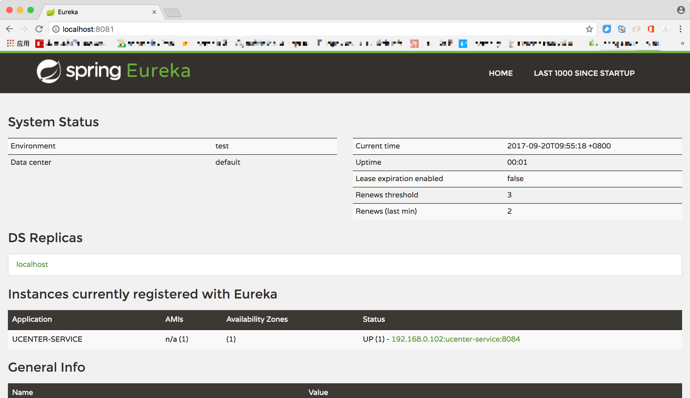
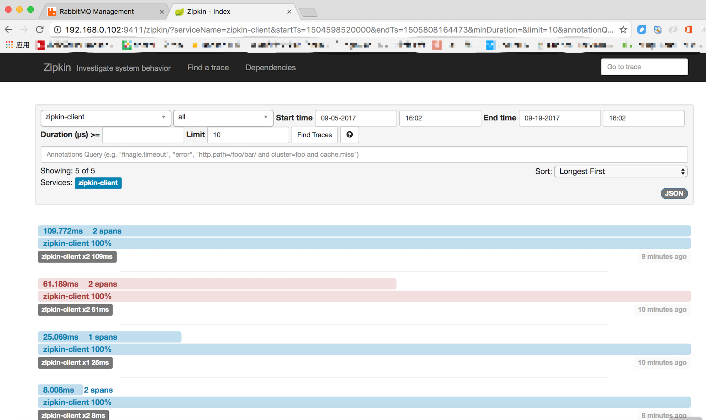

# spring-cloud-microservice

## 功能描述
使用spring cloud eureka,zuul,ribbon搭建的微服务框架

## 环境搭建
### 开发工具
- MySql: 数据库
- Git: 版本管理
- IntelliJ IDEA: 开发IDE
- Navicat for MySQL: 数据库客户端

### 开发环境
- Jdk8
- Mysql5.5+
- Redis
- RabbitMQ

### 启动顺序
eureka-service --> config-server -->  gateway-service --> 其他

## 项目结构


| 服务名称 | 模块名称 | 服务端口 | 管理端口 | 作用
|--------|--------|--------|--------|--------|
|eureka-service|ureka-service|8081|        |服务注册与发现
|gateway-service| gateway-service | 8082 |        |API网关
|ribbon-service| ribbon-service| 8083    |        |负载均衡
|config-server|config-server| 8881     |        |配置服务端
|config-client| config-client-service |8882 |        | 配置客户端
|monitoring-service|monitoring-service|8001||熔断监控服务
|zipkin-server|zipkin-server|9411||调用链追踪


``` lua
spring-cloud-microservice
├── common -- 框架公共模块
├── admin-service -- 后台管理模板
├── config-client-service -- 配置中心客户端[端口:8882]
├── config-repo -- 配置文件位置
├── config-server -- 配置中心服务端[端口:8881]
├── eureka-service -- 服务注册与发现[端口:8081]
├── gateway-service -- API网关[端口:8082]
├── monitoring-service -- 监控[端口:8001]
├── qrcode-service -- 监控[端口:8990]
├── order-service -- 订单服务模块
├── ribbon-service -- 负载均衡[端口:8083]
├── ucenter-service -- 用户模块[端口:8084]
└── zipkin-server -- 追踪[端口:9411]

```
## 技术栈
| 技术 | 描述|
|--------|--------|
|Spring boot| 微服务的入门级微框架，用来简化 Spring 应用的初始搭建以及开发过程。
|Eureka | 云端服务发现，一个基于 REST 的服务，用于定位服务，以实现云端中间层服务发现和故障转移。
|Spring Cloud Config |配置管理工具包，让你可以把配置放到远程服务器，集中化管理集群配置，目前支持本地存储、Git 以及 Subversion。
|Hystrix |熔断器，容错管理工具，旨在通过熔断机制控制服务和第三方库的节点,从而对延迟和故障提供更强大的容错能力。
|Zuul | 是在云平台上提供动态路由，监控，弹性，安全等边缘服务的框架。Zuul 相当于是设备和 Netflix 流应用的 Web 网站后端所有请求的前门。
|Spring Cloud Bus |事件、消息总线，用于在集群（例如，配置变化事件）中传播状态变化，可与 Spring Cloud Config 联合实现热部署。
|Spring Cloud Sleuth |日志收集工具包，封装了 Dapper 和 log-based 追踪以及 Zipkin 和 HTrace 操作，为 SpringCloud 应用实现了一种分布式追踪解决方案。
|Ribbon |提供云端负载均衡，有多种负载均衡策略可供选择，可配合服务发现和断路器使用。
|Turbine | 是聚合服务器发送事件流数据的一个工具，用来监控集群下 hystrix 的 metrics 情况。
|Spring Cloud Stream |Spring 数据流操作开发包，封装了与 Redis、Rabbit、Kafka 等发送接收消息。
|Feign | 是一种声明式、模板化的 HTTP 客户端。
|Spring Cloud OAuth2 | 基于 Spring Security 和 OAuth2 的安全工具包，为你的应用程序添加安全控制。

## 微服务架构图


## 部署说明

## 业务微服务依赖
zipkin client 依赖
```
	<dependency>
		<groupId>org.springframework.cloud</groupId>
		<artifactId>spring-cloud-sleuth-zipkin-stream</artifactId>
	</dependency>
	<dependency>
		<groupId>org.springframework.cloud</groupId>
		<artifactId>spring-cloud-starter-stream-rabbit</artifactId>
	</dependency>

```
config client 依赖
```
	<dependency>
		<groupId>org.springframework.cloud</groupId>
		<artifactId>spring-cloud-starter-config</artifactId>
	</dependency>

```
# 相关界面
- 服务发现与注册界面


- 消息队列


- 调用链追踪


## TODO
- [x] 动态路由
- [x] 流量限制
- [x] IP限制
- [x] 日志记录
- [x] API调用记录分析ELK
## 遇到的问题
1.2017-10-12 15:20:00.862 ERROR org.thymeleaf.TemplateEngine Line:1085 - [THYMELEAF][http-nio-8082-exec-1] Exception processing template "index": Error resolving template "index", template might not exist or might not be accessible by any of the configured Template Resolvers
  
  2017-10-12 15:20:00.870 ERROR org.apache.catalina.core.ContainerBase.[Tomcat].[localhost].[/].[dispatcherServlet] Line:181 - Servlet.service() for servlet [dispatcherServlet] in context with path [] threw exception [Request processing failed; nested exception is org.thymeleaf.exceptions.TemplateInputException: Error resolving template "index", template might not exist or might not be accessible by any of the configured Template Resolvers] with root cause
  org.thymeleaf.exceptions.TemplateInputException: Error resolving template "index", template might not exist or might not be accessible by any of the configured Template Resolvers
  
  在网上查了很多方案都不行，后来发现是由于mode为标准的H5 才行